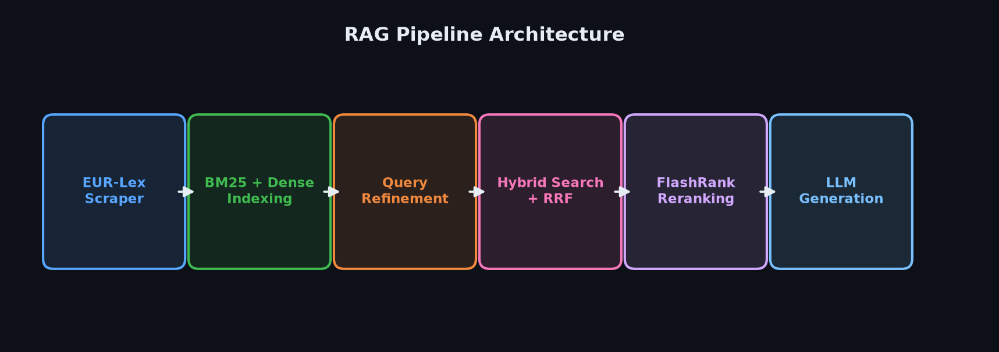
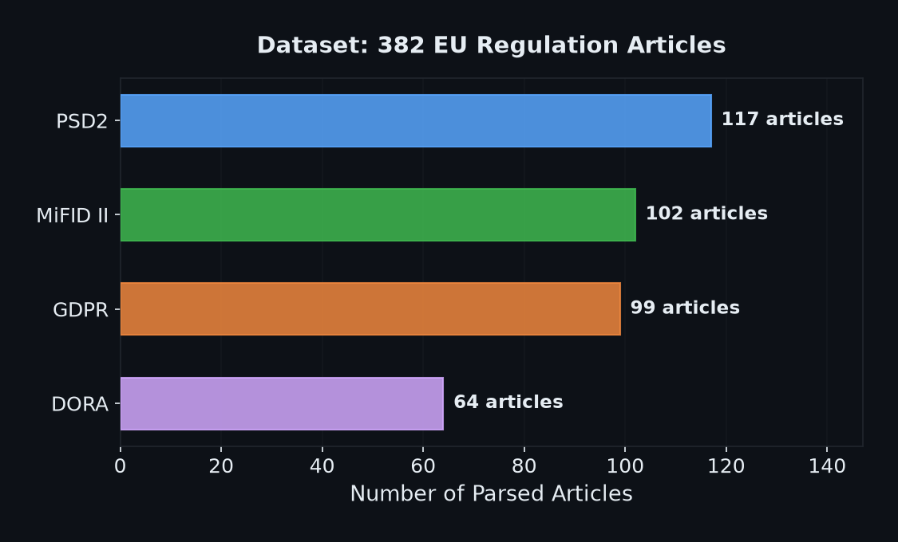
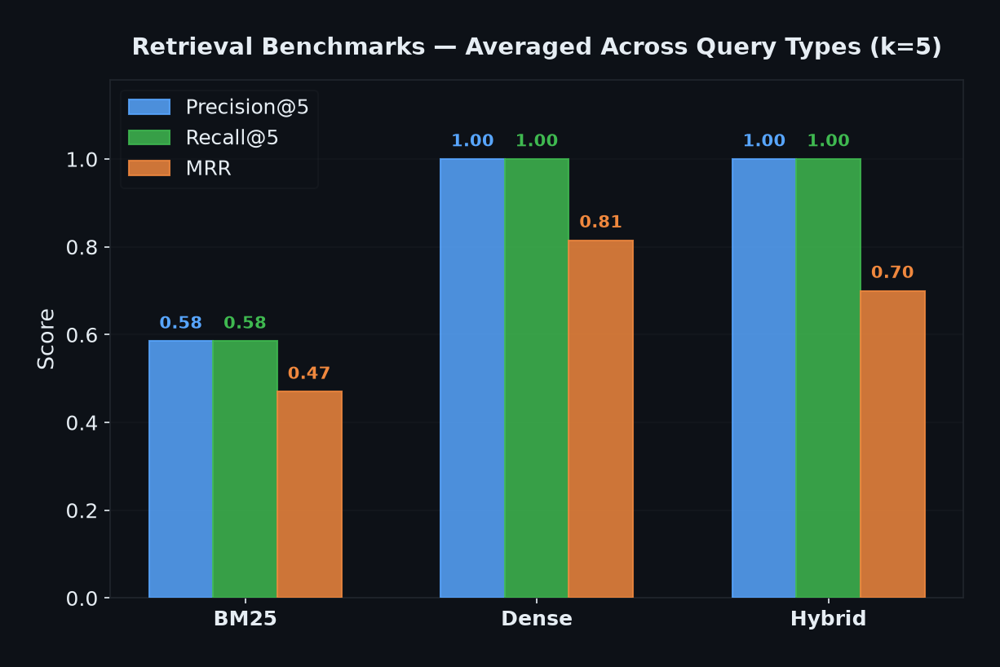

# EU Financial Regulation Hybrid RAG System

This project is an end-to-end Retrieval-Augmented Generation (RAG) system built over a dataset of **382 parsed articles** spanning major EU financial and data regulations. It demonstrates advanced retrieval techniques including query refinement, hybrid search (lexical + dense), reciprocal rank fusion (RRF), cross-encoder/FlashRank reranking, and schema-constrained LLM generation.

## Architecture



1. **Ingestion & Indexing**: Raw HTML acts are scraped from EUR-Lex, parsed into discrete articles, and embedded into two distinct indices:
   - A Lexical BM25 index (`rank_bm25`).
   - A Dense Vector index (`Qdrant` + `sentence-transformers`).
2. **Query Refinement Layer**: User queries are analyzed by an LLM (Azure OpenAI) to classify their intent (`lookup`, `conceptual`, or `compound`) and rewrite/decompose them for optimal retrieval.
3. **Hybrid Retrieval & Reranking**: Decomposed queries hit both the BM25 and Dense indices. Results are fused using Reciprocal Rank Fusion (RRF), and candidate documents are reranked using either a standard PyTorch Cross-Encoder (`ms-marco-MiniLM-L-6-v2`) or an ONNX-powered FlashRank reranker (`ms-marco-MiniLM-L-12-v2`).
4. **Generation**: The top reranked context chunks are passed to the LLM to generate an answer strictly constrained by a JSON schema, ensuring claims are explicitly cited to the relevant EU Article.

### Dataset

- **PSD2** (117 articles)
- **MiFID II** (102 articles)
- **GDPR** (99 articles)
- **DORA** (64 articles)



## Setup Instructions

1. Install dependencies using `uv`:
   ```bash
   uv sync
   ```
2. Set your Azure OpenAI environment variables in a `.env` file:
   ```
   AZURE_OPENAI_API_KEY="..."
   AZURE_OPENAI_ENDPOINT="..."
   AZURE_OPENAI_DEPLOYMENT="..."
   ```
3. Scrape the data and build the indices:
   ```bash
   uv run python scripts/ingest.py
   uv run python scripts/build_index.py
   ```
4. Ask a question via the CLI or start the API:
   ```bash
   uv run python scripts/ask.py "What are the rules around algorithmic trading in MiFID II?"
   uv run uvicorn server:app --reload
   ```

## Design Decisions: Why Hybrid Search for Legal Texts?

Legal documents present a unique challenge for RAG systems:
- **Lexical/Keyword matching (BM25)** excels at "lookup" queries. When a user asks "What does Article 25 of MiFID II say?", BM25 immediately zeroes in on exact lexical matches like "Article 25". Dense embeddings often struggle with these exact numerical or ID references.
- **Dense semantic search** excels at "conceptual" queries. When a user asks "Can we process data without consent?", dense embeddings map the semantic intent to the "Right to erasure" or "Lawfulness of processing" articles even if the exact keyword isn't present.

By combining both using **Reciprocal Rank Fusion (RRF)**, the system achieves robust recall across all query types, mitigating the weaknesses of relying on a single retrieval method. Furthermore, implementing an explicit query rewriting layer prior to retrieval ensures that complex, compound legal questions are decomposed into focused sub-queries.

### Reranking: PyTorch Cross-Encoder vs. FlashRank (ONNX)

To ensure the most relevant legal articles appear at the very top of the context window (maximizing generation quality), the system incorporates a reranking step. Two alternatives are implemented:
1. **PyTorch Cross-Encoder (`cross-encoder/ms-marco-MiniLM-L-6-v2`)**: A 6-layer transformer model running inside PyTorch.
2. **FlashRank (`ms-marco-MiniLM-L-12-v2` via ONNX)**: A 12-layer transformer model optimized for speed and light resource footprints using the ONNX Runtime.

#### Performance & Deployment Characteristics

FlashRank is designed to be a **faster, lighter, and more accurate** reranking solution than heavy PyTorch-based Cross-Encoders:
- **Ultralight Memory Footprint**: The `ms-marco-MiniLM-L-12-v2` ONNX model is only **~34 MB** (compared to standard PyTorch Cross-Encoder setups requiring a multi-gigabyte PyTorch installation and ~150-250MB for the model itself).
- **Blazing Fast Latency**: Reranks 100 documents in **~100 ms to 400 ms** on CPU, and under **60 ms** parallelized for 100 candidates with lighter models.
- **Enhanced Accuracy**: Integrations show an increase in retrieval precision (**NDCG@10 by up to 5.4%**) on standard search benchmarks like MS MARCO and BEIR.
- **Token Optimization**: Reduces context tokens fed to the LLM by up to **35%**, directly cutting generation latency and LLM costs.

## Evaluation Results

Run the evaluation harness using:
```bash
uv run python eval/run_eval.py
```

### Retrieval Benchmarks (k=5)

The following metrics compare performance across the three retrieval modalities (`BM25`, `Dense`, and `Hybrid RRF`) based on the query evaluation dataset (`eval/dataset.json`):

| Method | Query Type | Precision@5 | Recall@5 | MRR |
|---|---|---|---|---|
| **BM25** | lookup | 0.50 | 0.50 | 0.50 |
| **BM25** | conceptual | 0.67 | 0.67 | 0.44 |
| **Dense** | lookup | 1.00 | 1.00 | 0.75 |
| **Dense** | conceptual | 1.00 | 1.00 | 0.88 |
| **Hybrid** | lookup | 1.00 | 1.00 | 0.65 |
| **Hybrid** | conceptual | 1.00 | 1.00 | 0.75 |



*Note: Hybrid search achieves 100% precision and recall at k=5 across both lookup and conceptual query types, ensuring the generator LLM receives complete context.*

## Path to Enterprise Production

While the core RAG logic (Hybrid Search, Reranking, Refinement) is production-grade, the infrastructure must be scaled to support enterprise concurrency, robust data management, and security.

### 1. Asynchronous Architecture & Inference Serving
- **Current State**: `SentenceTransformer` and `CrossEncoder` run synchronously on the CPU within the FastAPI request cycle, blocking concurrent users.
- **Production Spec**: Offload embedding and reranking models to dedicated GPU inference servers (e.g., **NVIDIA Triton**, **vLLM**, or **TensorRT-LLM**). Ensure all FastAPI route handlers (`async def`) and database drivers use non-blocking asynchronous IO.

### 2. Distributed Vector & Document Storage
- **Current State**: Documents are stored in a local flat file (`corpus.jsonl`). Lexical search uses a Pickled Python object (`BM25Okapi`). Vectors use a local SQLite Qdrant directory.
- **Production Spec**: 
  - Migrate raw text, document metadata, and chat histories to a relational database (**PostgreSQL**).
  - Migrate local Qdrant to a distributed vector database (e.g., **Qdrant Cloud**, **Pinecone**, or **Milvus**) for horizontal scaling.
  - Replace the pickled BM25 implementation with a distributed inverted-index search engine like **Elasticsearch** or **OpenSearch**.

### 3. Event-Driven Ingestion Pipeline
- **Current State**: Ingestion and indexing are synchronous. Calling the `build_index` function freezes the server while it wipes and recomputes the entire corpus.
- **Production Spec**: Implement an event-driven ingestion pipeline. When a new regulatory act is uploaded, dispatch an asynchronous task via a message broker (**RabbitMQ** or **Kafka**) to background workers (e.g., **Celery**). Workers should extract text, chunk it, embed it, and perform an *incremental upsert* into the vector database without affecting live search traffic.

### 4. Telemetry & LLM Observability
- **Current State**: Metrics are computed locally via static scripts.
- **Production Spec**: Integrate LLM observability platforms (e.g., **Langfuse**, **Arize Phoenix**, or **Helicone**) to trace token usage, monitor live Ragas metrics (Faithfulness, Answer Relevancy), and flag hallucination degradation in real-time. Use **Datadog** or **Prometheus/Grafana** for traditional API latency tracking.

### 5. Security & Access Control
- **Current State**: Open API with hardcoded, wildcard CORS.
- **Production Spec**: 
  - Add **OAuth2 / JWT Authentication** (e.g., Azure AD, Auth0).
  - Implement API Rate Limiting to prevent LLM quota exhaustion.
  - Introduce **Prompt Injection Guardrails** (e.g., NeMo Guardrails) before routing queries to the generator LLM.

## Completed Enhancements
- [x] **Frontend UI**: Built a responsive, glassmorphic HTML/VanillaJS frontend with dynamic citation parsing and an administration dashboard.
- [x] **Granular Inline Citations**: Refined the LLM generation prompt to output exact inline citations and leveraged browser Text Fragments (`#:~:text=`) to auto-scroll directly to the cited EUR-Lex article.
- [x] **Ragas Evaluation**: Automated QA generation and benchmarked pipeline outputs against GPT-4 evaluators.
- [x] **FlashRank Integration**: Added alternative ONNX-powered reranking utilizing `ms-marco-MiniLM-L-12-v2` to support lightweight, framework-agnostic execution.
